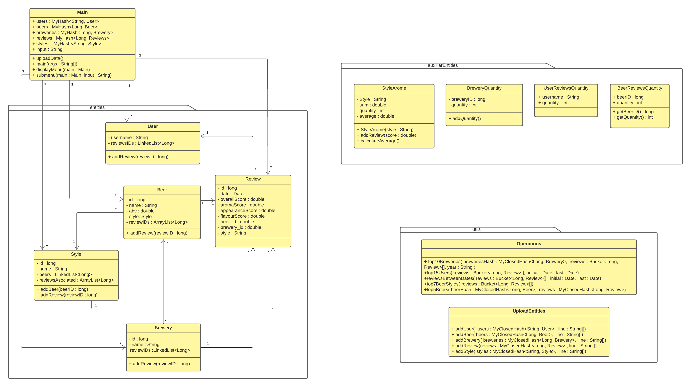
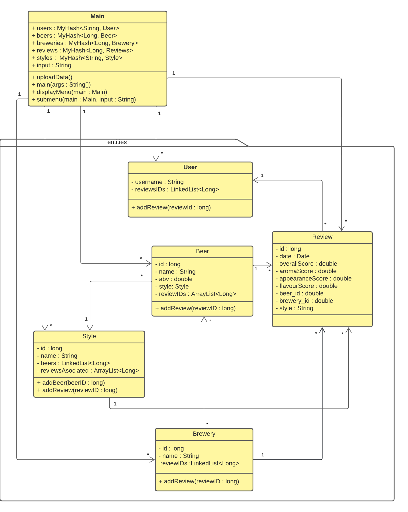
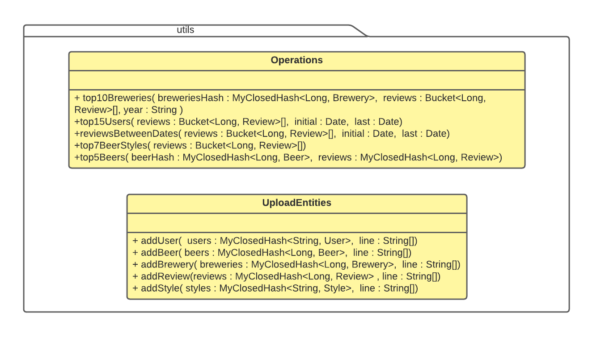
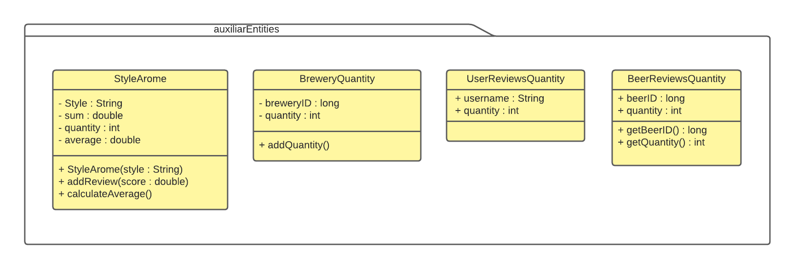
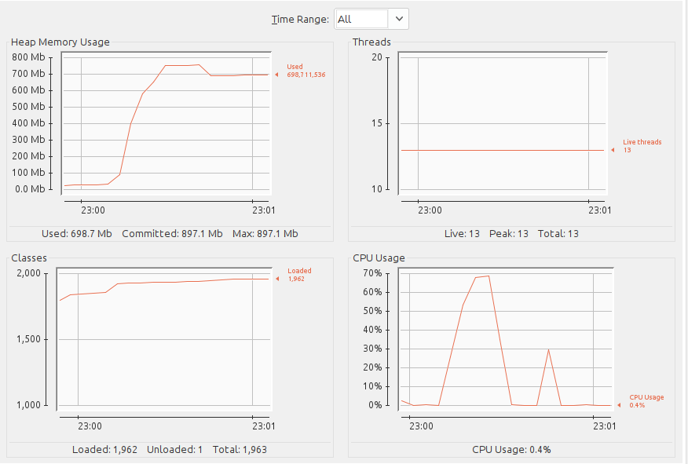
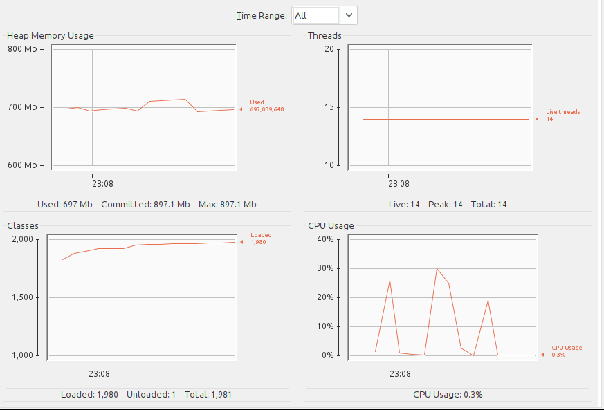
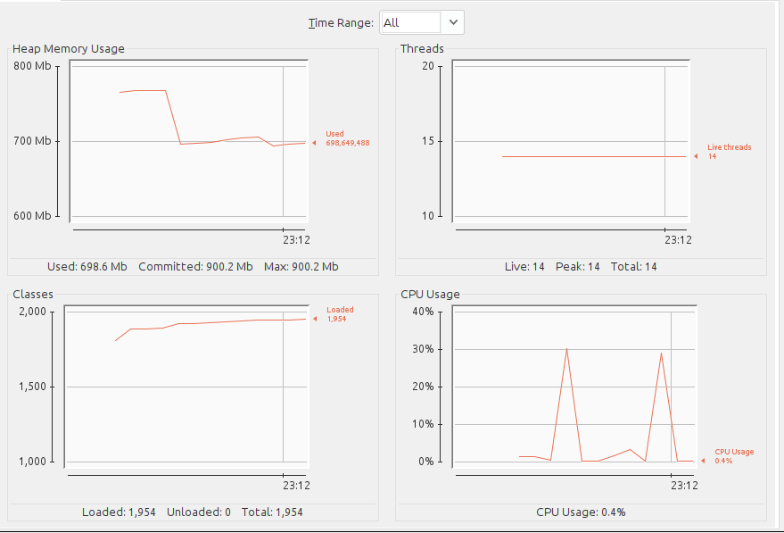
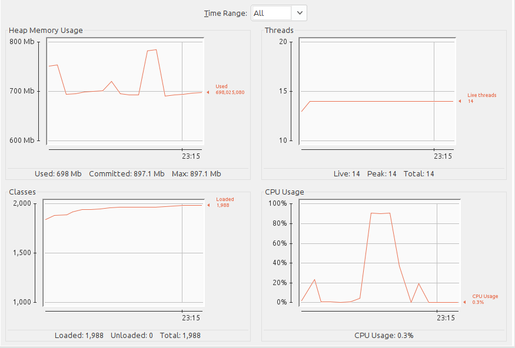
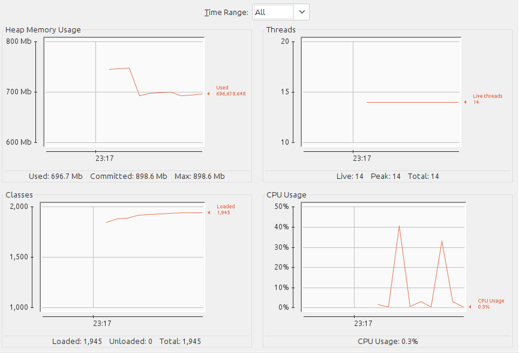
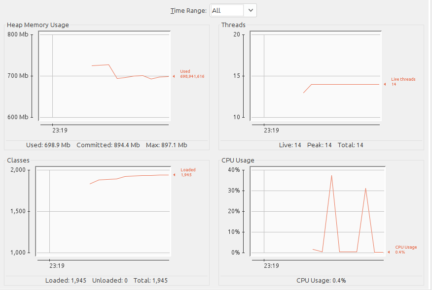

# Magalí Dellapiazza y Hernán Puschiasis

# Diagrama UML
Diagrama completo:

Entities:

Utils:

Auxiliar Entities:

# Carga de datos
Para la carga de datos se utilizaron para guardar en el main las casas de cerveza, las cervezas, los estilos, las reseñas y los usuarios Hashs cerrados. Esto se debe a que la inserción y búsqueda en este TAD es O(1) promedio. Los tamaños iniciales se determinaron en base a la rapidez de las consultas y la minimización del almacenamiento utilizado.  
Además, se utilizaron LinkedList's para guardar las ID's de las reviews asociadas a cada casa de cerveza y a cada usuario y para guardar las id's de las cervezas de cada estilo, ya que solo se necesitaba tener inserción O(1) y no ocupar demasiada memoria.  
Por último, se utilizaron ArrayList's las id's de las reviews asociadas a cada cerveza y a cada estilo, ya que no solo se necesitaba inserción O(1) sino que recorrer el TAD en O(n) (La LinkedList tiene O(n²) para recorrer ya que el get es de O(n) y recorrerla es O(n) también).  
En el proceso del llenado de los TAD's con los datos del csv, se utilizó la librería OpenCSV, que permite obtener cada línea del csv en un array, dividido por cada columna y teniendo en cuenta que si aparecen comillas y adentro una coma, se debe tomar como un solo atributo. También resuelve otros problemas como el de las múltiples comillas de un atributo.  
Mientras se van leyendo las líneas, se lee cada dato y se crea cada clase, parseando a Long o Double los atributos correspondientes y teniendo en cuenta que si algún atributo es null o isEmpty, se borra toda la línea, debido a que se quiere tener todos los datos en todas las clases.   
Cabe aclarar que el archivo beer_dataset_full.csv está preparado para cargarse en la carpeta src.  
El promedio de tiempo de ejecución de la carga es: 6781ms.  
A continuación se puede apreciar el uso de memoria en el programa, antes de arrancar la operación, cuando termina y luego de aplicar el garbage collector.

# Consulta 1
Primero se recorre el hash de reviews, para encontrar las reviews que aparecen en el año específico, y se va guardando la información en un nuevo hash, que utiliza la clase BreweryQuantity, que va contando la cantidad de reviews de una brewery en ese año. Esta operación toma O(reviews)*O(1) por recorrer el Hash de reviews y guardarlo en un hash.  
Luego se recorre el nuevo hash de breweries (O(breweries)) y se va insertando en un heap min de tamaño 10(log(10)), para que queden los 10 más grandes en el heap en todo momento, comparando el top (mínimo) con cada BreweryQuantity e intercambiando si aparece uno más grande (BreweryQuantity extiende Comparable).
Por último se desarma el heap en un array de tamaño 10 y se imprime en orden descendente (O(1)).  
La operación al final queda O(reviews)=O(n) lineal.
El promedio de tiempo de la consulta en 10 repeticiones para el año 2010 es: 751ms.  
A continuación se muestra el uso de memoria antes y después de aplicar el garbage collector.

# Consulta 2
Primero se recorre el hash de users y se van guardando en un heap min una entidad auxiliar que tiene el nombre del usuario y la cantidad de reviews. Esto toma O(users)*O(log(15)) debido a recorrer el hash e insertar en el heap min (misma estrategia que la consulta 1).  
Por último se desarma el heap en un array de tamaño 10 y se imprime en orden decreciente la información.
La operación queda O(users) = O(n) lineal.  
El promedio de tiempo de la consulta en 10 repeticiones es: 8ms.  
A continuación se muestra el uso de memoria antes y después de aplicar el garbage collector.

# Consulta 3
Se recorre el hash de reviews y se comparan todas las reviews con las dos fechas ingresadas. Si la review está en el rango, se suma uno en un contador y por último se devuelve el contador.  
La operación queda O(reviews) = O(n) lineal.
El promedio de tiempo de la consulta en 10 repeticiones es: 274ms.  
A continuación se muestra el uso de memoria antes y después de aplicar el garbage collector.

# Consulta 4
Se recorre el hash de reviews y se van guardando en un hash auxiliar la clase Style Arome de cada review. Si el style no estaba en el hash, se agrega una instancia de StyleArome con un atributo quantity inicializado en 1 y un atributo quantity inicializado con el aromaScore del estilo. Si ya existe el estilo, se busca en el hash y se incrementa la quantity y el score.  
Luego se recorre el hash auxiliar y se ingresan los StyleArome en un heap min de tamaño 7, ordenados por los promedios del arome score, que se calcula antes de insertarlo en el heap, con la misma metodología que los primeros dos métodos.  
Por último se desarma el heap, guardando los datos en un array e imprimiendo la información solicitada en el orden correspondiente.  
La operación tiene O(reviews) + O(Styles) = O(reviews).  
El promedio de tiempo de la consulta en 10 repeticiones es: 127ms.  
A continuación se muestra el uso de memoria antes y después de aplicar el garbage collector.

# Consulta 5
Se recorre el hash de cervezas y se van guardando en un heap min de tamaño 5 instancias de una entidad auxiliar BeerReviewQuantity, que almacena el id de la cerveza y la cantidad de reviews de cada cerveza.  
El heap solo se ordena por reviews, en caso de empatar en reviews, se toma aleatoriamente el mayor.  
Por último se desarma el heap, guardando los datos en un array e imprimiendo la información que se pide.  
La operación tiene O(beers) = O(n) lineal.  
El promedio de tiempo de la consulta en 10 repeticiones es: 16ms.  
A continuación se muestra el uso de memoria antes y después de aplicar el garbage collector.

# Conclusiones
La carga de datos ocupa 750mb, pero luego de llamar al garbage collector, queda en 698mb.  
Se observa que en todas las consultas, se usa memoria, siendo las consulta 1, 2 y 4 las más significativas en el uso de la memoria pero luego de hacer correr al garbage collector, se vuelve a los 698mb.  
Por último, se observa que la rapidez de ejecución y el uso de memoria están fuertemente relacionadas, ya que para tener buenos tiempos, se necesita almacenar información en TAD's auxiliares, para evitarse tener bucles anidados, como en la consulta 1 y 4.

